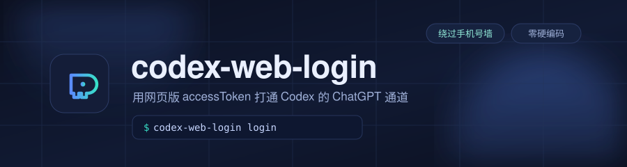

<div align="center">



**Make Codex Desktop show your real account — without an overseas phone number.**

<p>
<a href="#-quick-start"><b>Quick Start</b></a> ·
<a href="#-the-problem">The Problem</a> ·
<a href="#-faq">FAQ</a> ·
<a href="#-how-it-works">How It Works</a>
</p>

[](LICENSE)
[](https://www.python.org/)
[](#-requirements)
[](tests/)
[](CONTRIBUTING.md)

[English](README.en.md) · [简体中文](README.md)

</div>

---

> [!NOTE]
> **What is this?** A small tool that lets you **skip the overseas phone-number
> requirement** when signing into Codex Desktop, and makes the UI show your
> real avatar, name, plan, and usage bar.

> [!IMPORTANT]
> **It does not patch or modify Codex. No injection, no cracking, no data uploaded.**
> It simply puts a credential that **your own account** already obtained in the
> browser into the location Codex Desktop reads. See [How It Works](#-how-it-works).

---

## 😣 The Problem

Codex Desktop's "Sign in with ChatGPT" redirects to `auth.openai.com/add-phone` —
which **mandates an overseas phone number with no skip option.**

The strange part: **the exact same account signs into `chatgpt.com` in a browser
with no phone number at all.**

So your Codex Desktop gets stuck like this:

| What you see | What you want |
|:--|:--|
| "Logged in with API key" | Avatar + name + plan |
| No usage bar | Usage bar + reset date |
| Plugin market: `api key auth is not supported` | Plugin market works |
| Incomplete model list | Full model list |

**This tool fixes exactly that.**

---

## ✨ Quick Start

### Step 1 · Get a token (~30 seconds)

Sign in at <https://chatgpt.com/> in your browser and confirm you can chat.
Then press `F12` → **Console** → paste and hit Enter:

```js
fetch('/api/auth/session').then(r=>r.json()).then(d=>console.log(d.accessToken))
```

The console prints a long string starting with `eyJ` — **copy it**.

> [!TIP]
> Save the typing with the bundled helper:
> ```bash
> python scripts/get_token.py
> ```
> It puts the JS snippet on your clipboard and verifies you copied the right thing.

<details>
<summary><b>No output? Common cases</b></summary>

| Symptom | Cause | Fix |
|:--|:--|:--|
| `copy is not defined` | `copy()` unavailable in Console | **Use `console.log`** as shown above |
| Prints `undefined` | Not signed in / session expired | Refresh and confirm you can chat |
| Prints a big object | Wrong field | Use `d.accessToken`, not `d.session` |
| `Failed to fetch` | Network / proxy | Retry on another network or with a proxy |

</details>

### Step 2 · Install

```bash
pip install git+https://github.com/X1F2Y3/codex-web-login
```

> Requires Python 3.9+. Use a venv or `pipx install` if you prefer isolation.

### Step 3 · Log in

```bash
codex-web-login login --from-clipboard
```

It automatically: validates the token → closes Codex → backs up your config →
writes → verifies → restarts the desktop app.

Then verify:

```bash
codex-web-login check
```

Success looks like this:

```
[OK  ] auth.json           mode=chatgpt email=you@example.com plan=plus
[OK  ] codex login status  Logged in using ChatGPT
[OK  ] scope_v3.user       {"authMethod": "chatgpt", ...}
[OK  ] server usage        allowed=True used=0% limit_reached=False
--------------------------------------------------------------
Result: PASS  account info channel is live
```

---

## 🖼 Commands

| Command | Purpose |
|:--|:--|
| `codex-web-login login --from-clipboard` | **Most common** — read token from clipboard |
| `codex-web-login login --token-file f.txt` | Read token from a file |
| `codex-web-login login --dry-run` | **See what it would do**, change nothing |
| `codex-web-login check` | Read-only self-check (4 criteria) |
| `codex-web-login doctor` | Environment diagnostics (run this when debugging) |
| `codex-web-login backups` | List all backups |
| `codex-web-login restore <keyword>` | One-command rollback |

---

## 🔁 Switching Accounts

**Same command, different token.** All fields (email, plan, account ID) are
derived from the token itself — **no cross-contamination**, no dependency on
the previous account.

```bash
# 1. Switch to the new account in your browser, grab a fresh token
# 2. Run the same command
codex-web-login login --from-clipboard
# 3. Verify
codex-web-login check
```

---

## ❓ FAQ

<details>
<summary><b>Is it safe? Does it touch my system?</b></summary>

It only reads and writes **one file**: `~/.codex/auth.json` (Codex's own config).

- **Auto-backup** before every change, timestamped filenames
- **Auto-verify** after writing, **auto-rollback** on failure
- **No process injection, no patching, no uploads**, no telemetry
- Preview first: `codex-web-login login --dry-run`

</details>

<details>
<summary><b>Why is token retrieval manual? Can't it be fully automatic?</b></summary>

**We tried. All three automation routes hit dead ends** (measured):

| Route | Result |
|:--|:--|
| Read desktop cookie DB → call `/api/auth/session` | ❌ `WinError 32` — file locked exclusively while running |
| `codex login --with-access-token` | ❌ `agent identity JWT payload is not valid JSON` |
| `codex login --device-auth` | ❌ Stuck at the `add-phone` wall |

**The key:** `/api/auth/session` goes through **the OAuth client that doesn't
require a phone number**. That single copy step is both the only manual part
and the reason the whole approach works.

Everything else is automated: path discovery, proxy detection, process
management, backup, write, verify, launch.

</details>

<details>
<summary><b>Account info shows, but sending messages still fails?</b></summary>

**Those are two different things.** Account info ≠ usable quota.

The free tier has a monthly cap; once exhausted, requests fail — that is
**server-side quota**, not a config problem. Check the last line of `check`:

```
[OK  ] server usage   allowed=False used=100% limit_reached=True
```

`limit_reached=True` means the quota is spent — wait for reset or upgrade.

</details>

<details>
<summary><b>It stopped working after a few days?</b></summary>

Tokens expire in **about 10 days** and **do not auto-refresh** (they aren't
OAuth-issued, so there's no valid `refresh_token`).

Just redo the three steps.

</details>

<details>
<summary><b>Got "BOM" or `expected value at line 1 column 1`?</b></summary>

Classic symptom of hand-editing `auth.json` with PowerShell — PowerShell 5.1's
`Set-Content -Encoding UTF8` writes a BOM, which Codex cannot parse.

**Just re-run this tool** — it guarantees BOM-free output.

</details>

---

## 🔬 How It Works

In one sentence: **Codex only does structural validation on the `tokens` section
of `auth.json` — it never verifies the signature.**

So an `accessToken` from a browser session (a standard JWT) can be written
straight in; Codex takes the `chatgpt` protocol branch and the UI renders the
real account info.

> **This is not forging a credential.** It's a legitimate session token issued
> by your own account, placed where the desktop app expects to read it.

<details>
<summary><b>Source-level evidence (decompiled from app.asar)</b></summary>

The **only** function Codex uses to decide login state:

```js
function UN(e){
  return e == null ? `response_null`
    : e.authMethod !== `chatgpt` && e.authMethod !== `chatgptAuthTokens`
        ? `auth_method_not_chatgpt`
    : e.authToken == null ? `auth_token_missing`
    : null
}
```

Null check → string compare → non-null check.
**No signature verification, no `iss`/`aud`, no online check.**

Full analysis (unpacking method, UI render branch, official fixability) is in
**[docs/MECHANISM.md](docs/MECHANISM.md)**.

</details>

### Will this get me banned?

No — but let's be precise:

- **They *can* fix it** — ~5 lines of `iss`/`aud` validation client-side. A real
  fix would need server-side architecture changes.
- **They probably won't soon** — adding a phone wall to web signup would cut a
  large chunk of normal signups. That's a product decision, not a security one.
- **If they do** — `check` will start failing first; you just stop using this tool.

Please use it **only with your own account**.

---

## ⚙️ Configuration (all optional)

**No paths are hardcoded.** Everything is discovered via platform conventions;
override when needed:

| Env var | Purpose | Default |
|:--|:--|:--|
| `CODEX_HOME` | Codex config dir | `~/.codex` |
| `CODEX_WEB_LOGIN_PROXY` | Proxy URL | Auto-detects common local ports |
| `CODEX_WEB_LOGIN_LAUNCHER` | Custom launcher | See strategy chain |
| `CODEX_WEB_LOGIN_APP` | Desktop app path | Auto-discovered |

### Launcher strategy chain

**Everyone launches Codex differently**, so launching is a pluggable strategy
chain — tried in order, **stops at the first success**:

1. `CODEX_WEB_LOGIN_LAUNCHER` env var
2. `~/.codex/web-login-launchers.json`
3. Start Menu / Desktop `.lnk` shortcuts (Windows)
4. System shell forwarding (`explorer.exe` / `open -a`)
5. Direct spawn

Using your own manager? Just write a JSON file:

```json
{ "launchers": ["D:/tools/codex-manager.exe"] }
```

---

## ⭐ Recommended: Codex App Manager

If the **official installer feels slow**, try **Codex App Manager**:
<https://github.com/wangnov/codex-app-manager>

| | Official | App Manager |
|:--|:--|:--|
| Download speed | Slow, often stalls | **Noticeably faster** |
| Install / update / rollback | Manual MSIX juggling | **One-stop** |
| Proxy config | Do it yourself | **Built in** |
| Themes / skins | None | **Supported** |
| Multi-version management | None | **Supported** |

> [!NOTE]
> This tool is **natively friendly** to it — the launcher chain recognizes it
> automatically. But it is **not required**: everything works without it.

---

## ⚠️ Known Limitations

| Limitation | Detail |
|:--|:--|
| **Quota is your account's real cap** | Account info ≠ usable quota |
| **Token expires in ~10 days** | No auto-refresh; just redo the steps |
| **Signing out revokes it** | Web "log out" triggers server-side revoke; re-grab a token |
| **Relies on no signature check** | If OpenAI adds one, `check` will fail |

---

## 🛠 Development

```bash
git clone https://github.com/X1F2Y3/codex-web-login
cd codex-web-login
pip install -e ".[dev]"

pytest          # 31 unit tests
ruff check .    # lint
```

```
src/codex_web_login/
├── config.py     # Path discovery / settings (zero hardcoding)
├── token.py      # JWT parsing / atomic auth.json writes
├── process.py    # Process management
├── launcher.py   # Pluggable launch strategy chain
├── verify.py     # 4 criteria + server quota query
└── cli.py        # CLI entry point
```

PRs welcome — see [CONTRIBUTING.md](CONTRIBUTING.md). Feedback from **non-Windows
platforms** is especially valuable.

---

## ❤️ Support

- ⭐ **Star the repo** — it genuinely helps others find it
- 🐛 **Open an issue** — run `codex-web-login doctor` first and paste the output
- ☕ **Buy me a coffee** (entirely optional; all features are free)

---

## 📄 License

[MIT](LICENSE) · For personal learning and research use
