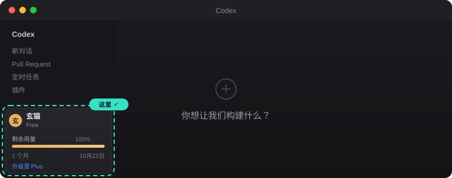
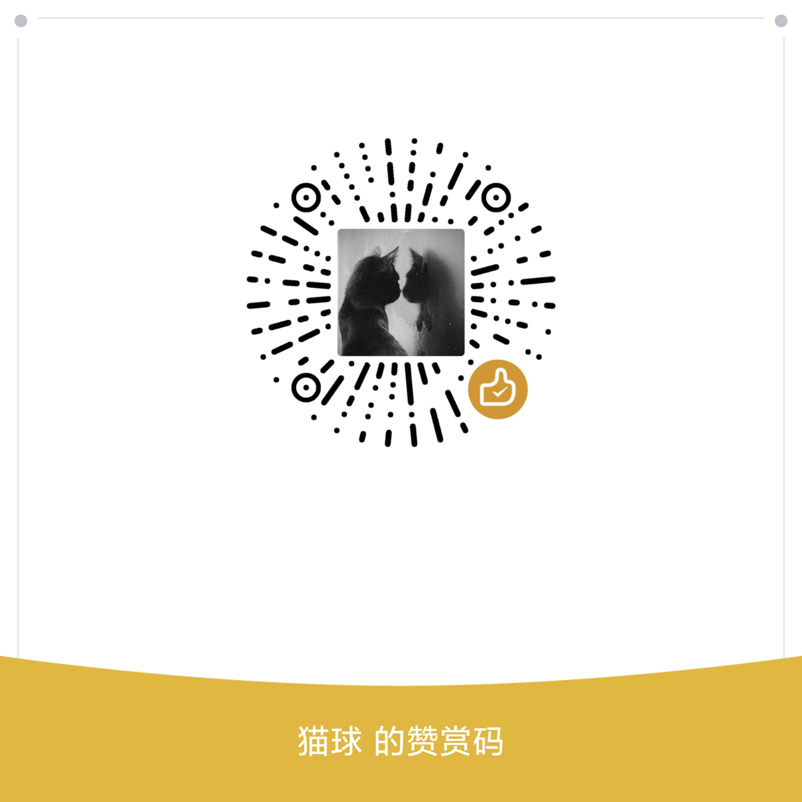

<div align="center">


**让 Codex 桌面端显示你的真实账号 —— 不用海外手机号。**

<p>
<a href="#-三步开始"><b>快速开始</b></a> ·
<a href="#-它解决什么问题">它解决什么</a> ·
<a href="#-常见问题">常见问题</a> ·
<a href="#-它是怎么做到的">原理</a> ·
<a href="#-推荐-codex-app-manager">推荐工具</a>
</p>

[](LICENSE)
[](https://www.python.org/)
[](#-环境要求)
[](tests/)
[](CONTRIBUTING.md)

[简体中文](README.md) · [English](README.en.md)

</div>

---

> [!NOTE]
> **这是什么？** 一个小工具，帮你在 Codex 桌面端登录时**跳过海外手机号验证**，
> 并让界面正常显示你的头像、姓名、档位和额度条。

> [!IMPORTANT]
> **它不修改 Codex 程序，不注入、不破解、不上传任何数据。**
> 只是把你**自己账号**在浏览器里已经拿到的登录凭据，放到桌面端读取的位置。
> 用你自己账号的合法凭据 —— 详见 [原理](#-它是怎么做到的)。

---

## 😣 它解决什么问题

Codex 桌面端点「Sign in with ChatGPT」后会跳到 `auth.openai.com/add-phone`，
**强制要求海外手机号，而且没有跳过按钮。**

但诡异的是：**同一个账号，浏览器网页版 `chatgpt.com` 登录完全不要手机号。**

于是你的 Codex 桌面端陷入这种状态：

| 你看到的 | 你想要的 |
|:--|:--|
| 「已通过 API 密钥登录」 | 头像 + 姓名 + 档位 |
| 看不到剩余额度 | 额度条 + 重置日期 |
| 插件市场报 `api key auth is not supported` | 插件市场正常可用 |
| 模型列表残缺 | 完整模型列表 |

**本工具就是来解决这一段的。**

---

## ✨ 三步开始

### 第 1 步 · 拿 token（约 30 秒）

浏览器登录 <https://chatgpt.com/>，确认能正常聊天。然后按 `F12` → 切到 **Console** → 粘贴回车：

```js
fetch('/api/auth/session').then(r=>r.json()).then(d=>console.log(d.accessToken))
```

控制台会打印一串以 `eyJ` 开头的长字符串 —— **复制它**。

> [!TIP]
> 用 `codex-web-login` 自带的引导助手可以省掉手敲：
> ```bash
> python scripts/get_token.py
> ```
> 它会把上面那行 JS 直接放进你的剪贴板，并帮你确认复制到的是正确的 token。

<details>
<summary><b>没看到输出？点这里看常见情况</b></summary>

| 现象 | 原因 | 解决 |
|:--|:--|:--|
| `copy is not defined` | `copy()` 在 Console 里不可用 | **改用上面的 `console.log`**，别用 `copy()` |
| 输出 `undefined` | 没登录 / 登录态过期 | 先刷新页面确认能正常聊天 |
| 输出 `{...}` 一堆对象 | 拿错字段了 | 确认用 `d.accessToken`（不是 `d.session`） |
| `Failed to fetch` | 网络/代理问题 | 换个网络或开启代理后重试 |

</details>

### 第 2 步 · 安装

```bash
pip install git+https://github.com/X1F2Y3/codex-web-login
```

<details>
<summary><b>其他安装方式 / 装不上怎么办</b></summary>

```bash
# 推荐：用 pipx 装成独立命令，不污染任何环境
pipx install git+https://github.com/X1F2Y3/codex-web-login

# Windows 上 pip 命令找不到？用
py -m pip install git+https://github.com/X1F2Y3/codex-web-login

# 不想安装，直接跑（把 <repo> 换成本仓库路径）
python <repo>/scripts/get_token.py
```

**注意**：`pip install codex-web-login`（不带 `git+`）会装到 PyPI 上**同名但无关**的包，
请务必用上面的完整形式。

装完验证：

```bash
codex-web-login --version
```

</details>

### 第 3 步 · 登录

```bash
codex-web-login login --from-clipboard
```

它会自动：「校验 token → 关闭 Codex → 备份原配置 → 写入 → 验证 → 重启桌面端」

然后复查：

```bash
codex-web-login check
```

看到这个就成功了：

```
[OK  ] auth.json           mode=chatgpt email=you@example.com plan=plus
[OK  ] codex login status  Logged in using ChatGPT
[OK  ] scope_v3.user       {"authMethod": "chatgpt", ...}
[OK  ] 服务端额度            allowed=True used=0% limit_reached=False
--------------------------------------------------------------
判定：PASS  账号信息通道已打通
```

<div align="center">

<p><i>登录成功后，左下角会显示真实账号与额度条</i></p>
</div>

---

## 🖼 命令一览

| 命令 | 用途 |
|:--|:--|
| `codex-web-login login --from-clipboard` | **最常用** —— 从剪贴板读 token 并登录 |
| `codex-web-login login --token-file f.txt` | 从文件读 token |
| `codex-web-login login --dry-run` | **先看看会发生什么**，不改动任何文件 |
| `codex-web-login check` | 只读自检（4 项判据） |
| `codex-web-login doctor` | 环境诊断（排查问题先跑这个） |
| `codex-web-login backups` | 列出所有备份 |
| `codex-web-login restore <关键词>` | 一键回滚 |
| `codex-web-login login --help` | 全部选项 |

---

## 🔁 换账号

**同一个命令，只换 token。** 工具从 token 里自己读出邮箱、档位、账号 ID，
**不会串号**，也**不依赖旧账号的任何数据**。

```bash
# 1. 浏览器切到新账号，重新取一次 token
# 2. 跑同一个命令
codex-web-login login --from-clipboard
# 3. 复查
codex-web-login check
```

> 换回去也简单：`codex-web-login backups` 找到旧备份，`codex-web-login restore <关键词>`。

---

## ❓ 常见问题

<details>
<summary><b>安全吗？会不会动我的系统？</b></summary>

不会。工具**只读写一个文件**：`~/.codex/auth.json`（Codex 自己的配置）。

- 每次修改前**自动备份**，文件名带时间戳
- 写入后**自动验证**，失败**自动回滚**
- **不注入进程、不打补丁、不联网上传**，无遥测
- 想先确认它会做什么：`codex-web-login login --dry-run`

</details>

<details>
<summary><b>为什么取 token 要手动复制？不能全自动吗？</b></summary>

**试过了，三条自动化路线全部走不通**（实测）：

| 路线 | 结果 |
|:--|:--|
| 读桌面端 cookie 库 → 调 `/api/auth/session` | ❌ `WinError 32` 文件被绝对独占，进程运行时读不到 |
| `codex login --with-access-token` | ❌ 报 `agent identity JWT payload is not valid JSON` |
| `codex login --device-auth` | ❌ 卡在 `add-phone` 手机号墙 |

**关键**：`/api/auth/session` 走的**正是那个不要求手机号的 OAuth client**。
所以这一行复制既是唯一的手工环节，**也正是整个方案能成立的原因**。

除了这一步，剩下全部自动化：路径发现、代理探测、进程管理、备份、写入、校验、启动。

</details>

<details>
<summary><b>显示账号信息了，但发消息还是失败？</b></summary>

**这是两件事。** 账号信息显示 ≠ 额度可用。

免费档每月有额度上限，用完就发不了 —— 那是**服务端额度池**，不是配置问题。
跑 `codex-web-login check` 看最后一行：

```
[OK  ] 服务端额度   allowed=False used=100% limit_reached=True
```

`limit_reached=True` 就是额度用完了，等重置或升级档位。

</details>

<details>
<summary><b>过几天又不能用了？</b></summary>

token **约 10 天过期**，而且**不会自动续期**（因为它不是 OAuth 换来的，没有有效的 `refresh_token`）。

到期后**重新走一遍三步**即可。如果不想记时间，可以在到期前重跑一次。

</details>

<details>
<summary><b>提示「有 BOM」或 `expected value at line 1 column 1`？</b></summary>

这是手动用 PowerShell 改过 `auth.json` 的典型症状 —— PowerShell 5.1 的
`Set-Content -Encoding UTF8` 会写入 BOM，Codex 无法解析。

**用本工具重跑一次就会修好**（它保证写入无 BOM）。

</details>

<details>
<summary><b>我之前用 API Key 登录过，会冲突吗？</b></summary>

不会。反过来，**如果你现在的 `auth.json` 是 API Key 形态，界面上就只会显示「已通过 API 密钥登录」**，
看不到账号信息 —— 这正是需要用本工具修正的场景。

本工具会把它替换成 `chatgpt` 形态（原文件自动备份）。

</details>

---

## 🔬 它是怎么做到的

一句话：**Codex 对 `auth.json` 里的 `tokens` 段只做结构校验，不验签。**

所以浏览器网页版 session 的 `accessToken`（标准 JWT）可以直接写进去，
Codex 会走 `chatgpt` 协议分支，界面于是渲染真实账号信息。

> **这不是伪造凭据。** 用的是你自己账号真实签发的合法 session token，
> 只是把它放到了桌面端读取的位置。

<details>
<summary><b>想看源码级证据（从 app.asar 反编译出来的判定函数）</b></summary>

Codex 判定登录态的**唯一**函数：

```js
function UN(e){
  return e == null ? `response_null`
    : e.authMethod !== `chatgpt` && e.authMethod !== `chatgptAuthTokens`
        ? `auth_method_not_chatgpt`
    : e.authToken == null ? `auth_token_missing`
    : null
}
```

判空 → 判字符串 → 判非 null。**没有签名验证、没有 `iss`/`aud`、没有在线校验。**

完整分析（含解包方法、界面渲染分支、官方可修复性评估）见
**[docs/MECHANISM.md](docs/MECHANISM.md)**。

</details>

### 会被官方封吗？

不会「封」。但要说清楚：

- **官方能修** —— 客户端加 `iss`/`aud` 白名单约 5 行代码。但根治需要服务端架构改动。
- **短期大概率不修** —— 给网页版加手机号墙等于砍掉大量普通用户注册，是产品决策而非安全决策。
- **届时会怎样** —— `codex-web-login check` 会先报错，然后你只需停用本工具。

请仅用于**你自己的账号**。不要用于批量注册、账号交易或规避服务条款的场景。

---

## ⚙️ 配置（全部可选）

**代码里没有任何硬编码路径。** 所有位置都通过平台惯例自动发现，需要时可覆盖：

| 环境变量 | 作用 | 默认 |
|:--|:--|:--|
| `CODEX_HOME` | Codex 配置目录 | `~/.codex` |
| `CODEX_WEB_LOGIN_PROXY` | 代理地址 | 自动探测常见本地端口 |
| `CODEX_WEB_LOGIN_LAUNCHER` | 自定义启动器 | 见下方策略链 |
| `CODEX_WEB_LOGIN_APP` | 桌面端程序路径 | 自动发现 |

### 启动策略链

**每个人启动 Codex 的方式都不同**，所以启动做成了可插拔策略链，
按序尝试、**第一个成功即停**：

1. `CODEX_WEB_LOGIN_LAUNCHER` 环境变量
2. `~/.codex/web-login-launchers.json`（自定义列表）
3. 开始菜单 / 桌面的 `.lnk` 快捷方式（Windows）
4. 系统 shell 转发（`explorer.exe` / `open -a`）
5. 直接启动

用你自己的管理器？写个 JSON 就行：

```json
{ "launchers": ["D:/tools/codex-manager.exe"] }
```

---

## ⭐ 推荐：Codex App Manager

如果你觉得**官方安装方式太慢、或者总是卡住**，强烈建议试试 **Codex App Manager**
—— 一个专门管理 Codex 桌面端的开源工具，**下载速度比官方好太多**。

<div align="center">

### [👉 github.com/Wangnov/Codex-App-Manager](https://github.com/Wangnov/Codex-App-Manager)

</div>

| | 官方安装 | App Manager |
|:--|:--|:--|
| 下载速度 | 慢，经常卡住 | **明显更快，国内可达** |
| 安装 / 更新 / 卸载 | 手动处理 MSIX | **一站式检测、安装、更新、卸载** |
| 启动 Codex | 自己找快捷方式 | **一键启动** |
| 代理配置 | 需自行处理 | **内置可配** |
| 增量更新 | 无 | **有**（macOS Sparkle 差量 + 校验 + 失败回滚） |
| 主题 / 皮肤 | 无 | **在线库，支持试穿和导入** |
| 多语言 | 跟随系统 | **11 种语言**（含阿语 RTL） |

安装方式：

```bash
# macOS
brew install --cask wangnov/tap/codex-app-manager
```

Windows / 其他平台 → [**下载最新版**](https://github.com/Wangnov/Codex-App-Manager/releases/latest)，
国内镜像：`codexapp.agentsmirror.com/manager/latest/`

> [!NOTE]
> 本工具对它是**原生友好**的 —— 启动策略链会自动识别它的启动器。
> 但**不依赖**它：不用 App Manager 也完全能跑，用官方安装同样可以。

---

## ⚠️ 已知限制

| 限制 | 说明 |
|:--|:--|
| **额度是账号真实上限** | 显示账号信息 ≠ 能用。额度耗尽需等重置或升级 |
| **token 约 10 天过期** | 不会自动续期，到期重跑一次即可 |
| **退出登录会作废** | 在网页端「退出登录」会触发服务端 revoke，需重新取 token |
| **依赖客户端不验签** | 官方若加校验会失效，届时 `check` 会报错 |

---

## 🛠 开发

```bash
git clone https://github.com/X1F2Y3/codex-web-login
cd codex-web-login
pip install -e ".[dev]"

pytest          # 31 个单元测试
ruff check .    # lint
```

```
src/codex_web_login/
├── config.py     # 路径发现 / 设置（零硬编码）
├── token.py      # JWT 解析 / auth.json 原子写入
├── process.py    # 进程管理
├── launcher.py   # 可插拔启动策略链
├── verify.py     # 4 项判据 + 服务端额度查询
└── cli.py        # 命令行入口
```

欢迎 PR —— 见 [CONTRIBUTING.md](CONTRIBUTING.md)。
特别欢迎**非 Windows 平台的实测反馈**。

---

## ❤️ 支持这个项目

如果它帮到了你：

- ⭐ **点个 Star** —— 这比什么都管用，能让更多人找到它
- 🐛 **提 Issue** —— 遇到问题先跑 `codex-web-login doctor`，把输出贴上来
- ☕ **请我喝杯咖啡**（完全自愿，不付费也能用全部功能）

<div align="center">

| 微信 | 支付宝 |
|:--:|:--:|
|  |  |

<sub>把二维码图片放到 <code>assets/</code> 目录即可显示</sub>

</div>

---

## 📄 License

[MIT](LICENSE) · 仅供学习研究与个人使用

<div align="center">
<br>
<sub>如果这个项目帮到了你，一个 Star 就是最好的回报</sub>
<br><br>

<a href="https://github.com/X1F2Y3/codex-web-login/stargazers">

</a>

</div>

